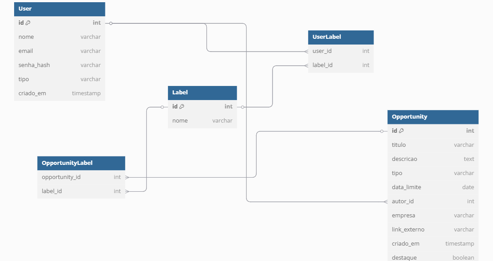

# Central de Vagas e Oportunidades Acadêmicas

**Autor:** [João Vitor Furtado de Freitas]

## Sumário
1. [Introdução](#1-introdução-semana-01)
2. [Visão Geral da Aplicação Web](#2-visão-geral-da-aplicação-web)
3. [Projeto da Aplicação Web](#3-projeto-da-aplicação-web)
4. [Desenvolvimento da Aplicação Web](#4-desenvolvimento-da-aplicação-web)
5. [Referências](#5-referências)

## 1. Introdução (Semana 01)
A Central de Vagas e Oportunidades Acadêmicas é uma plataforma web desenvolvida com o objetivo de centralizar a divulgação de oportunidades acadêmicas para alunos do Inteli. Atualmente, informações relevantes como estágios, projetos, eventos e competições são compartilhadas por múltiplos canais (como Slack, Whatsapp ou e-mail), dificultando o acompanhamento. A plataforma visa resolver esse problema oferecendo um ambiente unificado onde usuários podem visualizar, filtrar e compartilhar oportunidades. O sistema contará com usuários do tipo aluno, professor ou administrador, e fará uso de etiquetas (labels) para ajudar no pareamento entre interesses dos alunos e as oportunidades publicadas.

## 2. Visão Geral da Aplicação Web

### 2.1 Personas (opcional)


### 2.2 User Stories (opcional)


## 3. Projeto da Aplicação Web

### 3.1 Modelagem do banco de dados (Semana 3)


### 3.1.1 Modelo físico (schema.sql)
```sql
CREATE TABLE User (
  id SERIAL PRIMARY KEY,
  nome VARCHAR(255),
  email VARCHAR(255) UNIQUE,
  senha_hash VARCHAR(255),
  tipo VARCHAR(50),
  criado_em TIMESTAMP DEFAULT CURRENT_TIMESTAMP
);

CREATE TABLE Label (
  id SERIAL PRIMARY KEY,
  nome VARCHAR(255)
);

CREATE TABLE UserLabel (
  user_id INT REFERENCES User(id),
  label_id INT REFERENCES Label(id),
  PRIMARY KEY (user_id, label_id)
);

CREATE TABLE Opportunity (
  id SERIAL PRIMARY KEY,
  titulo VARCHAR(255),
  descricao TEXT,
  tipo VARCHAR(100),
  data_limite DATE,
  autor_id INT REFERENCES User(id),
  empresa VARCHAR(255),
  link_externo VARCHAR(255),
  criado_em TIMESTAMP DEFAULT CURRENT_TIMESTAMP,
  destaque BOOLEAN DEFAULT false
);

CREATE TABLE OpportunityLabel (
  opportunity_id INT REFERENCES Opportunity(id),
  label_id INT REFERENCES Label(id),
  PRIMARY KEY (opportunity_id, label_id)
);
```

### 3.1.1 BD e Models (Semana 5)

O banco de dados foi modelado com base nas principais entidades do sistema. A estrutura atual implementada inclui as seguintes tabelas:

- `User`: representa os usuários da plataforma, contendo `id`, `nome`, `email`, `tipo` e `senha_hash`.
- `Opportunity`: armazena as oportunidades cadastradas, com campos como `id`, `titulo`, `descricao`, `tipo` e `data_limite`.
- `Label`: categorias ou marcadores aplicáveis às oportunidades.

Essas tabelas foram mapeadas como modelos no backend utilizando JavaScript em conjunto com o Supabase/PostgreSQL. Cada model possui métodos específicos para operações CRUD. A comunicação com o banco é feita via SQL, com script de inicialização (`init.sql`) executado por meio de um módulo utilitário.

---

### 3.2 Arquitetura (Semana 5)

O projeto segue a arquitetura **MVC (Model-View-Controller)**, promovendo separação de responsabilidades e organização do código. A estrutura se divide em:

- **Model (Modelos)**:
  - Contêm a lógica de acesso ao banco de dados.
  - Representam entidades como `User`, `Opportunity`, `Label`.

- **View (Visões)**:
  - Implementadas com EJS, são responsáveis por exibir os dados ao usuário.
  - Localizadas na pasta `views/`.

- **Controller (Controladores)**:
  - Contêm a lógica de negócio e intermediam as requisições HTTP.
  - Ex: `userController`, `authController`, `opportunityController`, `labelController`.

- **Rotas (Router)**:
  - As requisições são roteadas por arquivos em `routes/`.
  - Exemplo do roteador principal (`routes/index.js`):
    ```js
    router.use('/auth', require('./auth'));
    router.use('/users', require('./users'));
    router.use('/opportunities', require('./opportunities'));
    router.use('/labels', require('./labels'));
    ```

- **Servidor Express**:
  - Arquivo principal `server.js` configura middlewares, EJS, assets estáticos e escuta a porta definida.

---


### 3.3 Wireframes (opcional)


### 3.4 Guia de estilos (opcional)


### 3.5 Protótipo de alta fidelidade (opcional)


### 3.6 WebAPI e endpoints (Semana 5)

A WebAPI RESTful da aplicação está estruturada por entidade, com rotas específicas para cada recurso. As principais rotas implementadas incluem:

#### Autenticação (`/auth`)
- `GET /auth/login`: Renderiza o formulário de login.
- `POST /auth/login`: Processa a autenticação.

#### Usuários (`/users`)
- `GET /users`: Lista todos os usuários cadastrados.
- `POST /users`: Cadastra um novo usuário.

#### Oportunidades (`/opportunities`)
- `GET /opportunities`: Lista todas as oportunidades.
- `POST /opportunities`: Cadastra uma nova oportunidade.

#### Labels (`/labels`)
- `GET /labels`: Lista todos os labels disponíveis.
- `POST /labels`: Cria um novo label.

### 3.7 Interface e Navegação (Semana 07)


## 4. Desenvolvimento da Aplicação Web (Semana 8)

### 4.1 Demonstração do Sistema Web (Semana 8)


### 4.2 Conclusões e Trabalhos Futuros (Semana 8)


## 5. Referências
